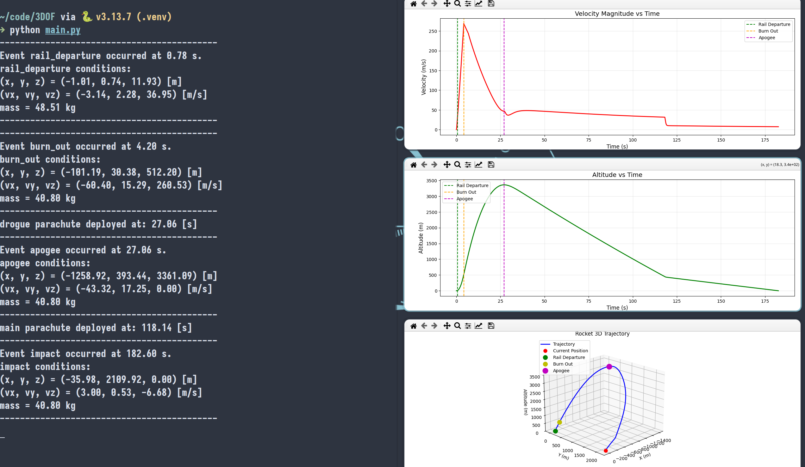

# Flight Forge

Flight Forge allows 3DOF simulations of rocket flights. 
3DOF simulations allow simulations on early design and development of the rocket. These simulations are useful when inertia tensors are still not defined, so we consider the rocket a mass point.

Through the parachute implementation, one can predict terminal velocities based on the mass of the rocket and the characteristics of the parachute

The workflow is similar to rocketpy. One needs to define the following:

## Environment

- wind profile 
- air density.

#### TODO:

* Use an api to get wind speed profile and air density profiles.


## Motor

- Thrust Curve
- Burn Time
- Burnrate of solid fuel
- Liquid Flow rate

(Consider mdot = burn rate of solid fuel + liquid mass flow rate)
(fuel_load = total fuel mass (solid + liquid if hybrid))

Or:

- Total Mass over time curve

## Rocket Body

- Diameter
- Dry Mass
- Drag Source (cd(Ma))

## Parachutes

- name
- cd_s (cd * ref_area)
- lag (total time until fully deployed)
- trigger event

## Workflow

```python
from flightForge import Environment, Motor, Rocket, Simulation, LivePlotter, Parachute

env = Environment()

motor = Motor("thrust(2).csv", 4.2, 9, 1.8, fuel_mass_ot="mass.csv")

rocket = Rocket(40.8, "MaCd.csv", 0.163)

rocket.add_parachute(Parachute("drogue", 0.7354, 1, "apogee"))
rocket.add_parachute(Parachute("main", 13.8991, 1, 450))


sim = Simulation(env, motor, rocket, 12, 84, 144, e_log = True) # Add plotter=LivePlotter(update_interval=x) to see live plotting
```

## Running:


