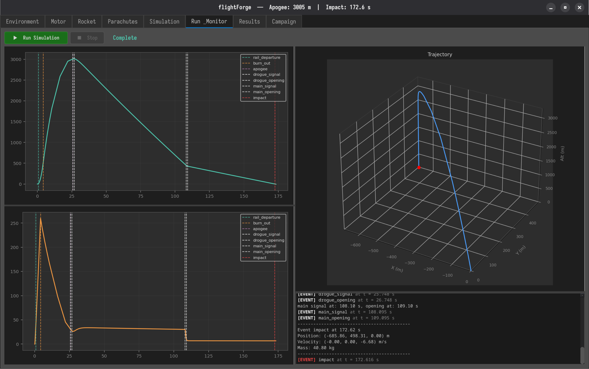
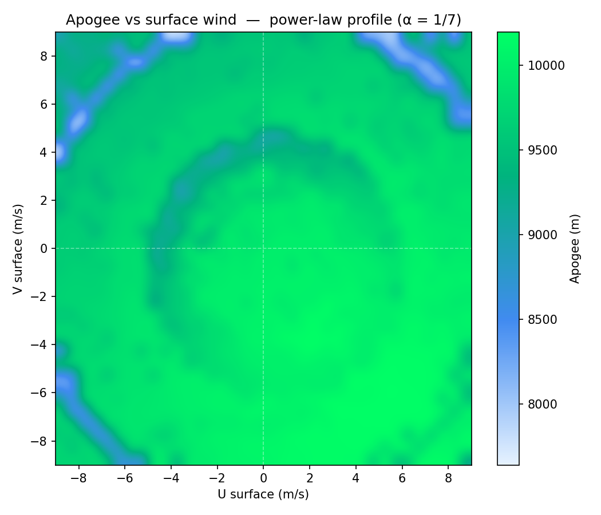

```
flightForge — 3DOF rocket flight simulator
==========================================

INSTALL

  pip install -e .

  Optional (Windy API wind data):
    API_KEY=<your key>  in .env or environment


CLASSES
-------

Environment
  Atmosphere model. Defaults to ISA density and zero wind. Pass api_key, lat,
  lon to pull real forecast wind and density from the Windy API. Accepts custom
  callables for wind components and density if you want your own profile.

Motor
  Engine model. Takes a thrust curve (CSV or callable), burn time, and
  propellant masses. Handles both solid (ox mass = 0) and hybrid motors.
  Derives exhaust velocity from total impulse and total propellant mass.

Rocket
  Airframe. Holds dry mass, diameter, and drag model (CSV or callable mapping
  Mach to Cd). Attach a motor and any parachutes to it before passing to a
  simulation.

Parachute
  Recovery stage. Defined by its drag area (cd_s), deployment lag, and a
  trigger ("apogee" or an altitude in metres). Chain as many as needed.

Simulation
  Runs the flight. Takes environment, rocket, rail length, inclination, and
  heading. Integrates the 3DOF equations of motion with RK45 (adaptive) or
  RK4 (fixed step). Tracks burnout, apogee, rail departure, and parachute
  events.

FlightData
  What Simulation.run() returns. Time-series arrays: position (x, y, z),
  velocity, acceleration, mass, thrust, drag, Mach, and mass flow rates.
  Has helpers to interpolate any array at a given time or altitude, and
  methods to plot 2D or 3D trajectories.

LivePlotter
  Optional real-time plots during a run. Three windows: 3D trajectory,
  altitude vs time, velocity vs time. Enabled by passing live_plot=True
  to Simulation.run().

Campaign  [flightForge.extras]
  Batch runner. Wraps a base environment and rocket, deep-copies them per
  run, and parallelises execution. Use .sweep() to vary one parameter across
  a list of values, .sweep_multiple() for a cartesian product or
  latin-hypercube sample, or .add_run() to queue a single custom override.
  Results come back as a CampaignResults object.


DATA RETRIEVAL (Windy API)
--------------------------

Environment calls api.windy.com/api/point-forecast/v2 with your key,
coordinates, and model name. It requests wind U/V and temperature at every
pressure level for the nearest forecast hour. The response is interpolated
to geopotential altitude using the ISA pressure-altitude relation and stored
as arrays. The simulation then queries wind and density by altitude via
linear interpolation over those arrays.
```

```python
env = Environment()
env.set_model(api_key="...", lat=39.39, lon=-8.29, model="iconEu")
```

```
To override wind manually without an API key:
```

```python
env = Environment(
    wind_u=lambda h: 5.0,   # constant 5 m/s east at all altitudes
    wind_v=lambda h: 0.0,
)
```

```
FEATURES
--------

ISA atmosphere
  Standard density, speed of sound, and dynamic viscosity as functions of
  altitude. Used as fallback when no API key or custom profile is given.

Windy API integration
  Pulls forecast wind and density for a specific launch site and date.
  Model is selectable (gfs, iconEu, etc.).

Hybrid motor support
  Separate oxidiser and grain masses, constant oxidiser flow rate, grain
  mass flow derived from total mdot minus ox flow.

Mach-dependent drag
  Cd interpolated from a curve at each integration step. Effective Cd
  accounts for deployed parachute drag areas added on top.

Parachute sequencing
  Multiple stages supported. Each parachute has a signal time (trigger met)
  and an opening time (signal + lag). Drag area steps up at opening.

Rail departure logic
  Rocket stays aligned to the rail direction until it has travelled
  rail_length metres; aerodynamic forces only apply after that.

Adaptive integration
  RK45 with configurable tolerances (rtol, atol). Fixed-step RK4 available.

Event interpolation
  Apogee, burnout, rail departure, and parachute events are pinpointed by
  linear interpolation between steps, not rounded to the nearest step.

FlightData queries
  at_time(t, array) and at_height(h, array) interpolate any stored array
  to an exact point.

Live plotting
  Real-time 3D trajectory, altitude, and velocity windows that update while
  the simulation runs.

Campaign sweeps
  Vary any dotted attribute path on environment or rocket (e.g. env.wind_u,
  rocket.dry_mass) across a list of values. Runs in parallel across all
  CPU cores.

Cartesian and LHS sampling
  sweep_multiple() builds either a full grid or a latin-hypercube sample
  over multiple parameters.

GUI
  PyQt6 interface covering all inputs (environment, motor, rocket,
  parachutes, sim settings), a run tab with live log output, and a results
  tab with selectable plots.
```



```
Wind sweep script
  wind_sweep_test.py: a 2D grid of surface wind conditions run as a
  campaign, producing a landing-scatter heatmap.
```


